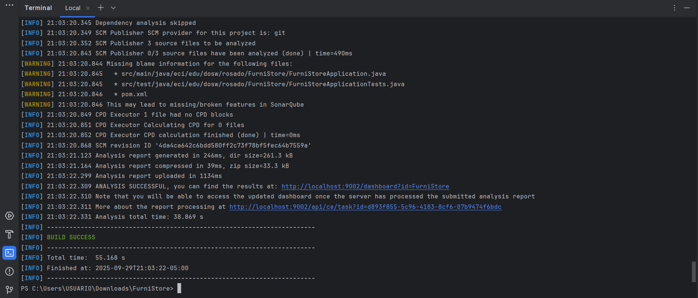

# Equipo Rosado - Caso de Estudio: FurniStore

---

##### Autor:

* ***Julián Santiago Ramírez Urueña***

---

### Tecnologías y dependencias configuradas en el proyecto:

* Lenguaje: Java 17
* Framework: Spring Boot + Lombok
* Calidad de código: SonarQube y JaCoco
* Gestión de dependencias: Maven
* Control de versiones: GitHub

### Evidencia de la compilación del ambiente de trabajo:

* Incluyendo las dependencias de Lombok y SonarQube

### Estrategia de Versionamiento y Branches

- `main`: versión estable para producción.
- `develop`: rama de desarrollo principal.
- `feature/*`: nuevas funcionalidades.
- `bugfix/*`: correcciones de errores.
- `release/*`: preparación de versiones.

### Notación de los commits:

***Cada commit realizado debe seguir el siguiente template: “feat: Equipo Rosado Parte n - Acción realizada”.***

---

### Caso de Estudio FurniStore:

Se estará trabajando en el desarrollo de una solución tecnológica que permita digitalizar la operación de la reconocida tienda de muebles ***FurniStore***. Dicha solución tecnológica sentará las bases de la programación orientada a objetos en conjunto a la implementación de buenas prácticas, como lo son los patrones de diseño y/o los principios SOLID. De este modo se garantiza que FurniStore reciba el varias veces mencionado ***recurso tecnológico, robusto, escalable y profesional***.

### Justificación Patrones de Diseño y principios SOLID:

* ***Patrones de Diseño***

Se identificó el patrón de diseño ***Abstract Factory Method***. De modo que FurniStore maneja un catálogo amplio de mueblería, se optó por generalizar la abstracción de los muebles a través de una clase abstracta llamada ***Furniture***. Esta contiene varios atributos y métodos que serán compartidos por las subclases (muebles en sí) que la extiendan, de ese modo, se gestionan los diferentes artículos de forma 'independiente'.

Bajo este mismo orden de ideas, se decidió entonces implementar el patrón Abstract Factory, a través del cual se dividirán los varios tipos de muebles según su estilo visual. Consecuentemente se irán estableciendo los gremios bajo los cuales se irán agrupando cada uno de los muebles; así, se definen entonces las ***familias del catálogo***.

Finalmente (por lo pronto) también se añadió el patrón de diseño ***Decorator***. Mediante BillingStructure se le dió un manejo 'similar' a la abstracción general que resolvió Furniture, es decir, la interfaz define los comportamientos de las facturas que la implementan y/o la llegarán a implementar. Pero además, con la ayuda del patrón de diseño especificado, será posible agregar comportamientos como ***IVA***, ***costos de envío*** y/o ***descuentos*** dinámicamente al módulo de facturación del sistema.

* ***SOLID***

En cuanto a los principios SOLID, tenemos que el SRP es cumplido pues, Furniture (modelo base con atributos y getters), Catalog(gestiona la colección de muebles disponibles), ShoppingCart(gestiona los ítems a agregar o remover del carrito), BillingStructure (toma las riendas de la facturación), BillingDecorator(añade los comportamientos dinámicos de la facturación), FurnitureFactory (siendo la fábrica de los objetos agremiados) y User (según cada tipo de usuario) se encargan de una y solamente una única responsabilidad.
También, OCP se hace presente pues, el sistema no requiere de modificaciones, sin embargo, cuenta con extensibilidad. Esto porque se pueden agregar nuevas familias de objetos, nuevos objetos como tal, nuevos comportamientos respecto a la facturación y también, nuevos tipos de usuario.

Por parte de LSP las subclases de Furniture (Chair, Table, Sofa) pueden reemplazar a Furniture sin problemas y cualquier familia concreta de FurnitureFactory sustituye a la interfaz sin romper el sistema. ISP se cumple a través de FurnitureFactory y BillingStructure pues, la primera se enfoca únicamente en la creación de artículos como tal, mientras que la segunda especifica 'la facturación a seguir', haciendo así que cada implementación cree únicamente aquello que le corresponde.

Finalmente, DIP se satisface porque los clientes dependen de abstracciones y no de implementaciones concretas.

---

### DIAGRAMACIÓN:

* Diagrama de Contexto:

URL al DCT - https://lucid.app/lucidchart/3c7e970a-5d55-479e-86c3-a6f86f0c373e/edit?viewport_loc=-659%2C-169%2C3476%2C1631%2CHWEp-vi-RSFO&invitationId=inv_e6326696-8a7c-4b09-a66b-359f4415f0ca

* Diagrama de Clases:

URL al DC - https://lucid.app/lucidchart/1bf0b5d2-d569-4900-88bb-5eaa509e0114/edit?viewport_loc=-73%2C-228%2C4222%2C2036%2CHWEp-vi-RSFO&invitationId=inv_1a24da31-8ed7-44f6-83a3-b4d82121f8ab

* Diagrama de Casos de Uso:

URL al DCU - https://lucid.app/lucidchart/0f1d32bc-fd34-45b3-980e-c12877d7f0d0/edit?viewport_loc=350%2C504%2C2564%2C2119%2C.Q4MUjXso07N&invitationId=inv_d90147c2-6560-4400-9224-590d79dcfb7f

---

### FURNISTORE - PRODUCT BACKLOG

* ***HU1 - INICIO DE SESIÓN***

  _'Como Usuario Gerente o Usuario Cliente, quiero realizar el inicio de sesión en el sistema de FurniStore, para poder acceder a las funcionalidades asignadas a mi rol.'_

  CRITERIOS DE ACEPTACIÓN HU1:

  - El sistema valida las credenciales que se ingresaron.
  - Si las credenciales son correctas, se dirige al panel correspondiente.
  - Si las credenciales no son válidas, se mostrará un mensaje de error.

* ***HU2 - GESTIONAR EL CATÁLOGO***

  _'Como Usuario Gerente, quiero ejercer la gestión del catálogo de productos, para poder mantener siempre vigente la oferta de los muebles de la tienda en el sistema.'_

  CRITERIOS DE ACEPTACIÓN HU2:

  - El Usuario Gerente puede crear, editar y eliminar los productos del catálogo cuando lo requiera.
  - Los productos deben incluir su id, nombre, material, precio y estilo visual.
  - Únicamente el gerente dispone de los permisos para acceder a estas funcionalidades.

* ***HU3 - CONSULTAR EL CATÁLOGO***

  _'Como Cliente, quiero consultar el catálogo de muebles disponibles, para poder tener claridad sobre los artículos y las cantidades que podría comprar.'_

  CRITERIOS DE ACEPTACIÓN HU3:

  - Se listan los productos con su id, nombre, material, precio y estilo visual.
  - Los productos que generen interés pueden ser agregados al carrito de compras.

* ***HU4 - GESTIONAR EL CARRITO DE COMPRAS***

  _'Como Cliente, quiero agreagar o eliminar los productos que me generen y/o generaron interés de mi carrito de compras, para poder preparar mi pedido antes de realizar el pago.'_

  CRITERIOS DE ACEPTACIÓN HU4:

  - El cliente podrá agregar los productos del catálogo que le llamaron la atención.
  - El cliente puede eliminar los artículos previamente añadidos al carrito si así lo desea.
  - El sistema actualiza el carrito.

* ***HU5 - FACTURACIÓN***

  _'Como Cliente, quiero generar una factura con el detalle de los productos seleccionados, para poder conocer el costo final si bien se incluye el IVA, o el costo de envío o se aplica algún descuento'._

  CRITERIOS DE ACEPTACIÓN HU5:

  - La factura debe incluir los productos seleccionados y en tal caso, el IVA, los costos de envío y/o los descuentos aplicables.
  - El sistema la genera automáticamente después de confirmar la compra.

* ***HU6 - PAGOS***

  _'Como Cliente, quiero realizar el pago de los productos que seleccioné, para poder finalizar (como se debe) el proceso de mi pedido.'_

  CRITERIOS DE ACEPTACIÓN HU6:

  - El pago debe ser con uno de los métodos de pago válidos y ya especificados en el sistema.
  - Se muestra un mensaje que confirmará el ticket del pedido.

* ***HU7 - Historial de Pedidos***

  _'Como Cliente, quiero consultar el historial de pedidos que realicé, para poder tener un 'control' y un seguimiento sólido de mis compras anteriores.'_

  CRITERIOS DE ACEPTACIÓN HU7:

  - Se debe mostrar la lista de TODOS los pedidos que realizó el cliente.

* ***HU8 - Consultar Compras de Clientes***

  _'Como Gerente, quiero consultar los registros de las compras de los clientes, para poder supervisar y verificar las ventas realizadas; además, será posible conocer más de cerca el o los intereses de los compradores.'_

  CRITERIOS DE ACEPTACIÓN HU8:

  - Se muestran las compras que realizó cada cliente y la información general respectiva al pago(fecha, productos adquiridos etc).
---

### SPRINT PLANNING

* HU1 - Inicio de Sesión:

  - `Crear la entidad Usuario y el proceso básico de autenticación.`
  - `Rama: feature/login`
  - `Encargado: Julián Ramírez1`
  - `Estimación: 1 punto`

* HU2 - Gestionar el Catálogo:

  - `Crear y configurar los permisos del Gerente para la gestión del catálogo.`
  - `Rama: feature/ctalogManagement`
  - `Encargado: Julián Ramírez1`
  - `Estimación: 1 punto`

* HU3 - Consultar el Catálogo:

  - `Implementar las clases Furniture, FurnitureFactory y Catalog.`
  - `Rama: feature/catalog`
  - `Encargado: Julián Ramírez2`
  - `Estimación: 1 punto`

* HU4 - Gestionar el Carrito de Compras:

  - `Construir la clase del carrito de compras.`
  - `Rama: feature/shoppingCart`
  - `Encargado: Julián Ramírez3`
  - `Estimación: 1 punto`

* HU5 - Facturación:

  - `Desarrollar las clases BillingStructure, Bill, BillDecorator y sus derivados.`
  - `Rama: feature/billing`
  - `Encargado: Julián Ramírez1`
  - `Estimación: 1 punto`

* HU6 - Pagos:

  - `Realizar el ENUM para los métodos de pago.`
  - `Rama: feature/payment`
  - `Encargado: Julián Ramírez2`
  - `Estimación: 1 punto`

* HU7 - Historial de Pedidos:

  - `Llevar a cabo el proceso de consulta de las compras para cada cliente.`
  - `Rama: feature/billingHistory`
  - `Encargado: Julián Ramírez3`
  - `Estimación: 1 punto`

* HU8 - Consultar Compras de CLientes:

  - `Establecer los procesos de consulta de los 'registros' de las compras que realizaron los clientes en la tienda a través del sistema.`
  - `Rama: feature/billingHistoryManagement`
  - `Encargado: Julián Ramírez3`
  - `Estimación: 1 punto`
---